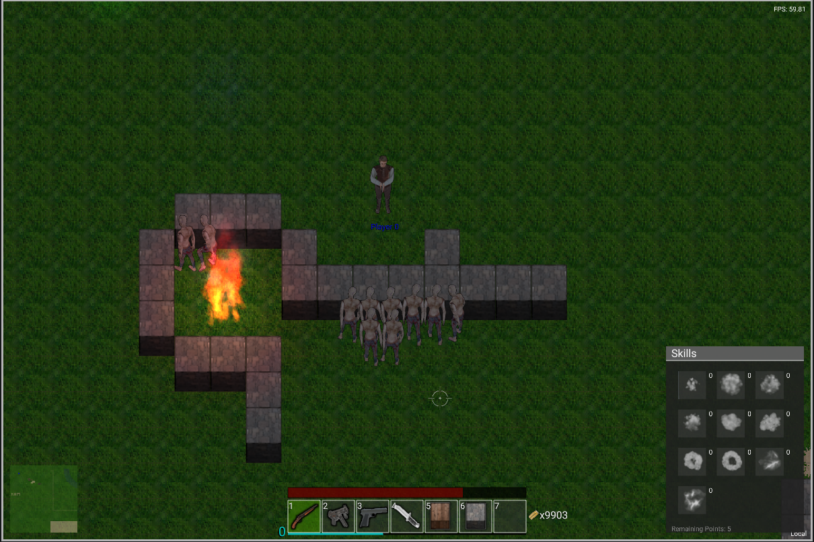

# Postmortem

:zombie:

This is a work-in-progress 2D game




## TODO

- Create hitboxes for Zombies
- Add projectile collision
- Draw only what is visible
- Add draw\_line function
- Add draw\_rect function

## DONE

- Write map loader
- Do simple world tile drawing using atlas lookup
- Add projectile support
- Add starter graphics for Zombie and Player
- Create image draw APIs with OpenGL

## Build and Run Example

```bash

    sudo pacman -S --needed gcc glfw glew
    ./run.sh


